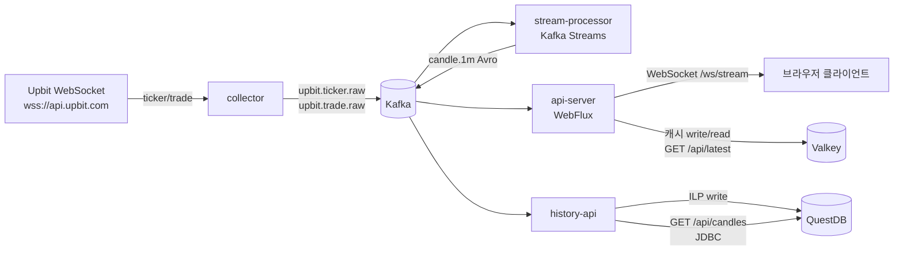
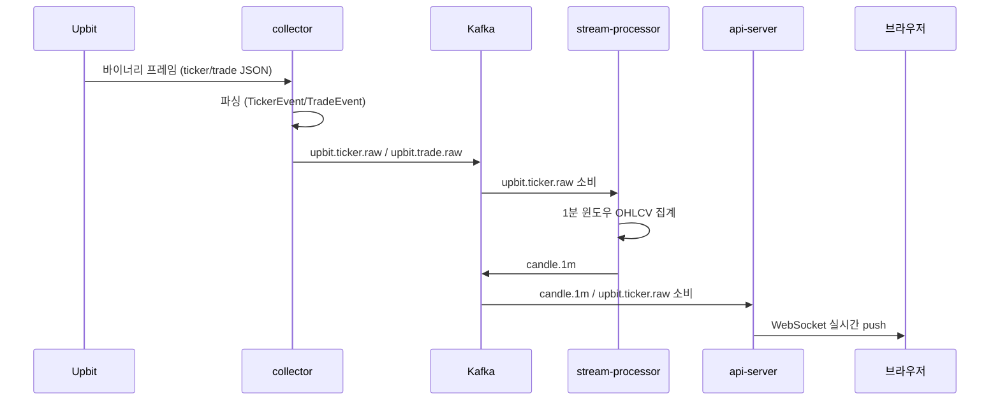

# Upbit Price Stream — Kafka & Kubernetes 기반 실시간 암호화폐 시세 스트리밍 파이프라인

업비트(Upbit) 공개 WebSocket에서 들어오는 실시간 시세를 **Apache Kafka**로 수집·분산 처리하고, **Kubernetes** 위에서 각 컴포넌트를 독립적으로 배포·확장하는 것을 목표로 하는 스트리밍 데이터 엔지니어링 포트폴리오 프로젝트입니다.

> **현재 단계: Phase 2 진행 중** — Kubernetes + Strimzi Operator + Helm(HPA 포함) + ArgoCD GitOps, QuestDB 영속화, Valkey 캐시, Avro + Apicurio 스키마 레지스트리까지 로컬 k3d/docker-compose에서 실제 배포·동작 검증 완료. 남은 항목은 관측성/통합테스트입니다. 자세한 내용은 [Phase 2 (예정)](#phase-2-예정), [`k8s/README.md`](k8s/README.md), [`argocd/README.md`](argocd/README.md) 참고.

## 왜 Kafka인가

업비트는 다수의 마켓(KRW-BTC, KRW-ETH, KRW-XRP …)에 대한 시세/체결 이벤트를 초당 다건, 불규칙한 빈도로 밀어냅니다. 단순히 "WebSocket으로 받아서 바로 처리하고 바로 내보내는" 구조는 수집 속도와 처리 속도가 강하게 결합되어, 처리 쪽에서 지연이나 재시작이 발생하면 데이터가 유실됩니다.

Kafka를 중간에 두면:

- **생산자(collector)와 소비자(stream-processor, api-server)가 분리**되어, 한쪽이 느려지거나 재시작해도 다른 쪽에 영향을 주지 않습니다.
- **내구성 있는 재생(replay)** 이 가능해, 장애 이후에도 업비트에 다시 연결하지 않고 이미 수집된 이벤트를 재처리할 수 있습니다.
- **다중 소비자 구조**를 자연스럽게 지원합니다 — collector 코드를 건드리지 않고 `candle.1m`에 새 소비자(`history-api`, QuestDB 영속화)를 추가했습니다.

`candle.1m`은 stream-processor가 만들어서 우리 서비스끼리만(api-server, history-api) 주고받는 내부 계약이라, Avro + [Apicurio Registry](https://www.apicur.io/registry/)로 스키마를 강제합니다. 반면 `upbit.ticker.raw`/`upbit.trade.raw`는 업비트 원본 포맷을 그대로 반영하는 수집 경계라 JSON을 유지합니다 — 우리가 스키마를 통제하는 지점에만 스키마 거버넌스를 적용한 의도적 선택입니다.

## 왜 Kubernetes인가

collector·stream-processor·api-server는 서로 다른 축으로 스케일링이 필요합니다 — collector는 구독 중인 WebSocket 연결 수, stream-processor는 파티션 수/CPU, api-server는 동시 WebSocket 클라이언트 수에 좌우됩니다. Kubernetes는 컴포넌트별로 독립적인 HPA(오토스케일링)와 self-healing(예: collector 크래시 시 자동 재시작)을 제공하여, 이 프로젝트가 "한 번 실행하고 끝나는 스크립트"가 아니라 "계속 살아있는 서비스"로 동작할 때 필요한 특성을 정확히 보여줍니다. 앱 3개 모두 CPU 기준 HPA(`minReplicas: 1, maxReplicas: 3`)가 실제로 붙어 있고, k3d 로컬 검증에서 기동 시 CPU 스파이크로 3 replica까지 스케일 아웃되는 것도 확인했습니다. Kafka 자체도 Strimzi Operator를 통해 K8s 네이티브 리소스(`Kafka`, `KafkaNodePool` CR)로 선언적으로 운영합니다. 배포도 수동 `kubectl`/`helm` 명령이 아니라 [ArgoCD GitOps](argocd)로 관리합니다 — git에 push하면 클러스터를 직접 건드리지 않아도 자동으로 반영됩니다 — [`charts/upbit-price-stream`](charts/upbit-price-stream) 참고.

## 아키텍처



## 데이터 흐름 (이벤트 하나의 생애주기)



## 모듈 구성

| 모듈 | 역할 |
|---|---|
| `common` | 공유 DTO(`TickerEvent`, `TradeEvent`, `CandleEvent`), Kafka 토픽 상수 |
| `collector` | 업비트 WebSocket 클라이언트 → Kafka 프로듀서. 연결 끊김 시 자동 재연결 |
| `stream-processor` | Kafka Streams 기반 1분 캔들(OHLCV) 집계 |
| `api-server` | Reactive Kafka Consumer → WebSocket(`/ws/stream`)으로 실시간 전송, Valkey에 마켓별 최신 시세 캐시(`GET /api/latest/{market}`) |
| `history-api` | `candle.1m`(Avro)을 QuestDB에 영속화(ILP), `GET /api/candles`로 히스토리 조회 |

## 기술 스택

| 영역 | 선택 | 비고 |
|---|---|---|
| 언어 | Kotlin 2.3.20 | |
| 런타임 | Java 21 (LTS) | |
| 프레임워크 | Spring Boot 4.1.0 | collector/stream-processor는 MVC, api-server는 WebFlux |
| 메시징 | Apache Kafka 4.2.x (KRaft) | ZooKeeper 없이 컨트롤러 내장 |
| 스트림 처리 | Kafka Streams | 1분 tumbling window OHLCV 집계 |
| 리액티브 Kafka | reactor-kafka | api-server의 실시간 소비/전송 |
| 직렬화 | kotlinx.serialization | Kafka 메시지 JSON 직렬화 |
| 빌드 | Gradle 9.5.1 (Kotlin DSL) | |
| CI | GitHub Actions | |
| 컨테이너 오케스트레이션 | Kubernetes + Strimzi + Helm + ArgoCD | K8s 매니페스트/HPA/GitOps 자동 동기화까지 k3d 검증 완료 |
| 시계열 저장소 | QuestDB 9.4.3 | ILP(쓰기) + Postgres wire/JDBC(조회), `DEDUP UPSERT KEYS`로 부분 캔들 업데이트를 (market, 분)당 1행으로 압축 |
| 캐시 | Valkey 8.1 | Redis 대신 — RSAL/SSPL 라이선스 전환 이후 커뮤니티가 옮겨간 BSD-3 포크, 프로토콜 호환. 마켓별 최신 시세 캐시(TTL 24h) |
| 스키마 레지스트리 | Avro + Apicurio Registry 3.3.1 | `candle.1m`(내부 계약)만 적용, Confluent 미의존 순수 Apache-2.0 스택 |
| 관측성 | OpenTelemetry + Prometheus/Loki/Tempo + Grafana | **Phase 2 예정** |

## 로컬 실행

```bash
# 1. 각 모듈 jar 빌드 (compose 이미지가 이 결과물을 그대로 복사함)
./gradlew build

# 2. Kafka + collector + stream-processor + api-server + questdb + history-api + valkey + apicurio-registry 전체 스택 기동
docker compose up -d --build

# 3. 실시간 스트림 확인 (api-server는 호스트 18080 포트로 노출)
websocat ws://localhost:18080/ws/stream

# 4. 히스토리 조회 (history-api는 호스트 18083, QuestDB 웹 콘솔은 19000)
curl "http://localhost:18083/api/candles?market=KRW-BTC&from=0&to=9999999999999"

# 5. 최신 시세 캐시 조회
curl "http://localhost:18080/api/latest/KRW-BTC"

# 6. candle.1m 스키마 등록 확인 (Apicurio Registry, 호스트 18084)
curl "http://localhost:18084/apis/registry/v3/search/artifacts"
```

## Kubernetes 실행 (k3d)

Strimzi Operator로 Kafka를, [Helm 차트](charts/upbit-price-stream)로 앱 4개(+QuestDB, +Valkey, +Apicurio Registry, +HPA)를
띄웁니다. 두 가지 배포 경로가 있습니다:

```bash
# 직접 helm upgrade --install (자세한 설계 근거는 k8s/README.md)
./k8s/deploy.sh

# 또는 ArgoCD GitOps — git push만으로 클러스터에 자동 반영 (argocd/README.md)
./argocd/deploy.sh

kubectl -n upbit get pods
kubectl -n upbit get hpa
kubectl -n upbit port-forward svc/api-server 18081:8080
```

## Phase 2 (예정)

- [x] Kubernetes 매니페스트 + Strimzi Operator로 Kafka 클러스터 운영 (k3d로 로컬 검증 완료)
- [x] 위 매니페스트를 Helm 차트로 패키징 (+ HPA 오토스케일링 추가, k3d에서 실제 스케일 아웃 확인)
- [x] ArgoCD GitOps 배포 (git push → 자동 동기화까지 k3d에서 실제 확인)
- [x] QuestDB 영속화 (저장 + 조회 API) — `history-api` 모듈, ILP 쓰기 + JDBC 조회, DEDUP UPSERT KEYS 검증 완료
- [x] Redis 캐시 레이어 — Valkey, `api-server`에 마켓별 최신 시세 캐시(`GET /api/latest/{market}`, TTL 24h)
- [x] Avro + Apicurio 스키마 레지스트리 — `candle.1m`(내부 계약)만 적용, WebSocket/REST는 계속 JSON
- [ ] OpenTelemetry/Prometheus/Loki/Tempo/Grafana 관측성 스택
- [ ] Testcontainers 기반 통합 테스트
